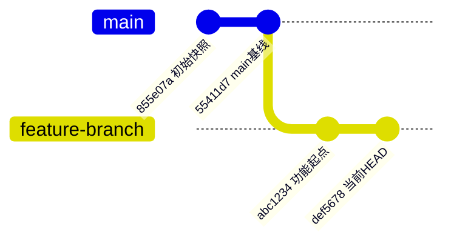

# AZF Personal Habits

Use this skill as An Zhaofeng's global personal preference layer. Treat it as a standing collaboration habit: protect rollback ability, keep work recoverable, leave a clean handoff trail, follow document-format preferences, and preserve frontend style preferences.

## Core Rules

- Prefer reading this skill first when a task is for An Zhaofeng and personal workflow preferences may matter.
- User facts and boundaries have their formal version in `agent-memory` under `vault/用户记忆/`; this skill only maintains operational procedures. If they conflict, follow the vault and remind An Zhaofeng. Locate `agent-memory` through `azf-agent-memory` first.
- Before doing anything to a project, first state the proposed plan. If any important requirement, target path, scope, risk, or expected output is uncertain, ask An Zhaofeng for confirmation. Wait for explicit confirmation before running commands, editing files, or making irreversible project changes, unless the user has already clearly authorized immediate execution.
- Before changing project code or project artifacts, explicitly distinguish whether the user asked for analysis/recording only or also authorized implementation. If the user only asks to update a work record, analyze a problem, evaluate a scheme, or explain behavior, do not modify project code "while you are there". First provide a short implementation plan, list affected files and risks, and wait for An Zhaofeng's second confirmation before editing code. Treat this as mandatory for all code changes, even small obvious fixes.
- Be proactive, but keep reminders concise and timed to natural checkpoints.
- For multi-step work, keep a visible next-step trail so a new chat/model can resume quickly.
- When creating Markdown documents, do not write the document title again inside the body content unless the user explicitly asks for an in-document heading. If there is no body title, start the remaining section hierarchy at `#` instead of `##`.
- When creating or editing Obsidian Markdown notes with properties, write exactly one YAML frontmatter block at the very start of the file. The first bytes must be plain `---` with no UTF-8 BOM or hidden character before it; never create a second `--- ... ---` metadata block below the first one. Merge `创建时间` / `修改时间` and business fields such as `项目`, `类型`, `状态`, `aliases`, and `tags` into that single block.
- Before substantial code edits, inspect repository state with `git status` when inside a Git repo.
- If the workspace is not a Git repo and the user is starting meaningful coding work, recommend initializing Git before edits.
- Before risky or broad changes, remind the user to create a branch.
- When Codex creates branches, makes commits, merges, rebases, tags, or otherwise manages Git history for An Zhaofeng, generate or update a lightweight Git visualization/handoff record by default.
- After each small completed milestone, remind the user to make a local commit.
- At important checkpoints, remind the user to push to GitHub.
- At confirmed success points, remind the user to create a Git tag.
- If a change goes wrong, prefer safe rollback commands such as `git restore --source=<commit> -- <file>` or `git revert <commit>`; avoid destructive reset unless the user explicitly asks.
- Maintain or update a progress handoff file for multi-step projects so a new chat/model can resume quickly.
- During debugging, bug fixes, project code changes, hardware/software investigation, or Git commit/push workflows, do not modify Obsidian notes unless An Zhaofeng explicitly asks in the current turn to update/sync/write/organize notes. Bound Obsidian notes may be read for context, but the note vault is read-only by default during code work. If note updates would be useful but were not requested, mention them as a pending optional follow-up in the final response instead of editing the vault.
- If An Zhaofeng explicitly asks to update Obsidian notes, first state the affected note files and whether the change is append-only or structural. For broad, structural, or formatting-sensitive note changes, create a rollback backup before writing, then report exactly what changed and why.
- Before modifying important user files, create a rollback backup first when the task is broad, risky, or user asks for backup. If the user does not specify a backup location, default to the Codex backup root `E:\software\CodexPlusPlus\Codex备份`, then create one clearly named task subfolder such as `YYYYMMDD_HHMMSS_任务名_修改前备份`, and put the backed-up files inside that task folder. This keeps rollback points centralized and easy to find.
- When writing Obsidian notes or research/workflow records for An Zhaofeng, prefer his plain working-note tone: write like a clear lab handoff, use common Chinese where possible, explain necessary technical terms in one sentence, and avoid stacking professional jargon without context.
- Do not make notes sound more professional than needed. Optimize first for "future An Zhaofeng can understand this at a glance": write the plain meaning, then the technical detail. It is better to say "这一步确认 GUI 真的打开了这台设备" than to only say "完成设备身份闭环验证". Add a small amount of warmth when appropriate, such as acknowledging why a detour was confusing or why a conclusion matters, while keeping the note concise.
- When reorganizing An Zhaofeng's existing Obsidian notes, preserve the user's original reasoning chain before improving structure. Do not flatten an explanatory paragraph, screenshot sequence, or folded callout into a generic agent summary when the original order explains why a later decision was made.
- When installing agent skills, use `C:\Users\anzhaofeng\.skills-manager\skills` as the unified local install directory by default. This directory is the canonical source of local skills and must contain real skill directories, not links that point outward into another agent or plugin directory. When another agent or plugin needs the same skill, create the link in that agent/plugin directory pointing back to Skills Manager. If Skills Manager is not installed on a new computer or that directory is unavailable, remind An Zhaofeng to install Skills Manager first. If the task is urgent, install the skill into the current agent's default skills directory instead and say that it is a temporary fallback.
- When creating a new personal skill for An Zhaofeng, name the skill folder and SKILL frontmatter `name` with the `azf-` prefix. Examples: `azf-hardware-skill`, `azf-server-deploy`, `azf-obsidian-work-record`.
- Treat skills with the `azf-` prefix as An Zhaofeng's own custom skills. When a task can match both a generic/system skill and an `azf-` custom skill, read and follow the relevant `azf-` skill first, then use generic skills only as supporting implementation tools.
- If An Zhaofeng explicitly names or provides a custom skill for a task, prioritize that skill even when another installed skill has a similar description. State which custom skill is being used and follow its output, QA, and workflow requirements.
- When An Zhaofeng says "精读", "逐句精读", "论文精读", or asks to generate paper deep-reading notes, default to the `azf-paper-sentence-deep-reading` skill. If he explicitly says "不需要跳转", do not force PDF++ selection links; keep the paragraph-per-note structure, break-ice preview, sentence cards, and glossary workflow, and use page/paragraph/sentence positioning instead.
- When creating, supplementing, or optimizing any skill, maintain the README file in that skill folder at the same time. The README should be written in Chinese for An Zhaofeng, summarize what the skill does, when it should trigger, important stored facts or preferences, and the latest meaningful maintenance note.
- For hardware, server assets, or equipment facts, prefer `azf-hardware-skill`. For server Docker deployment paths, compose layout, reverse proxy, backup, and service-operation conventions, prefer `azf-server-deploy`.

## Frontend Preference

When An Zhaofeng asks to build a frontend, website, app, dashboard, landing page, game, or interactive page:

- Prefer considering React Bits as a source of ready-made animated React components, visual backgrounds, text effects, and polished interaction pieces when the project is React/Next/Vite-compatible.
- Prefer GSAP for custom animation logic, page-level choreography, timelines, scroll-driven animation, and React animation cleanup/performance patterns.
- Treat React Bits as a visual component source, not a mandatory dependency. Do not add it when the design should stay plain, operational, lightweight, or when the existing project style conflicts with it.
- Combine React Bits and GSAP when useful: React Bits for local visual components, GSAP for orchestration and custom behavior.
- Prioritize usability, readability, product fit, and the existing design system over visual flash.

## Backup Habit

When An Zhaofeng asks for a backup but does not name a location:

1. Use `E:\software\CodexPlusPlus\Codex备份` as the default top-level backup folder.
2. Create one task-specific second-level folder named with timestamp and purpose, for example `20260530_190000_FrogTrace笔记整理前备份`.
3. Put all files for that rollback point inside this second-level folder, preserving useful directory structure when possible.
4. Tell An Zhaofeng the exact backup path before making edits.
5. Avoid scattering backup files directly on the Desktop or other project folders.

## Markdown Document Habit

When creating a `.md` document file for the user:

- Do not duplicate the document title as a first `# ...` heading in the body by default.
- Let the filename, Obsidian note title, or surrounding context carry the title.
- Start the body directly with the substantive content, metadata block, summary, or first necessary section.
- For Obsidian notes with properties, the metadata block must be the only frontmatter block and must start at byte 0 with plain `---`. Save files as UTF-8 without BOM. Do not paste or generate `---` (`U+FEFF` before the delimiter), because Obsidian plugins such as `Update time on edit` may fail to recognize the existing properties and create a duplicate `创建时间` / `修改时间` block.
- If adding AI-generated metadata to an existing note, inspect the current top frontmatter first and merge new fields into it. Keep `创建时间`, `修改时间`, `项目`, `类型`, `状态`, `aliases`, `tags`, and similar fields together in the single top block; do not insert another YAML block into the body.
- If the Markdown body has no explicit document title, use `#` for the first-level content sections, `##` for subsections, and `###` only below that. Do not start ordinary sections at `##` unless a body title already occupies `#`.
- Add a body title only when the user explicitly requests it, the template requires it, or the document would be ambiguous without it.

Example preferred body start:

```markdown
---
created: 2026-05-28
tags:
  - frogtrace
---

# 背景

...
```

Avoid this unless requested:

```markdown
# FrogTrace 调试记录

## 背景

...
```

## Visual Note And Excalidraw Habit

When creating diagrams, visual notes, paper idea maps, project maps, or Excalidraw files for An Zhaofeng:

- Prefer An Zhaofeng's relevant custom skills first, especially `azf-project-note-binding`, `azf-obsidian-work-record`, and any task-specific `azf-` skill supplied by the user.
- For actual Excalidraw generation, layout, text sizing, arrow routing, output format, and visual QA, use the dedicated `excalidraw-diagram` skill as the single source of truth.
- When using Excalidraw MCP and the tool reports `127.0.0.1:3000` / `api/elements` connection failure, do not bypass MCP by manually fabricating `.excalidraw.md` files. First inspect the local MCP deployment and start the canvas server. On An Zhaofeng's current machine, the known local deployment is `E:\software\MCP\mcp_excalidraw`; start it with `npm run canvas` from that directory, then verify `http://127.0.0.1:3000/health` before drawing. Remember that `dist/index.js` is the MCP stdio server, while `npm run canvas` starts the Excalidraw canvas / REST API service.
- After creating Excalidraw output, visually verify that text labels actually render on the canvas or in an exported screenshot. Empty colored boxes are not acceptable output.
- Keep this habit layer focused on routing: use project/work-record skills for intent and destination, then use `excalidraw-diagram` for how to draw.

## Skill Maintenance Habit

When creating, updating, or optimizing a skill under `C:\Users\anzhaofeng\.skills-manager\skills`:

1. Update the skill's `SKILL.md` with only the instructions needed for agents.
2. Update or create the skill folder's `README.md` in Chinese so An Zhaofeng can quickly understand it.
3. For personal skills, use the `azf-` prefix in both the folder name and SKILL frontmatter `name`. Existing personal skills without the prefix should be renamed when An Zhaofeng identifies them as his own.
4. Keep secrets out of skills and README files: never record passwords, API keys, tokens, private keys, cookies, or recovery codes.
5. If the update changes the overall skills catalog, refresh the top-level `C:\Users\anzhaofeng\.skills-manager\skills\README.md`.
6. If the work is broad or affects important personal rules, make a small rollback backup before editing.

Preferred Chinese README content:

- 这个 skill 解决什么问题。
- 什么时候应该触发。
- 当前保存的关键事实、偏好或规则。
- 最近一次维护日期和维护内容。

## Git Reminder Timing

Use short reminders at natural points, not noisy repetition.

Before starting a new coding task:

```text
Git checkpoint: before changing this, we should check status and consider a branch if this is more than a small edit.
```

Before broad or uncertain edits:

```text
This is branch-worthy. Create a branch before we touch the main line.
```

After a small milestone is complete and verified:

```text
Good checkpoint for a local commit.
```

After an important milestone succeeds:

```text
This is worth pushing to GitHub.
```

After a stable success that the user may need to return to:

```text
This is tag-worthy.
```

## Preferred Workflow

For code changes, follow this rhythm:

1. Read the relevant project context.
2. Check Git state when possible.
3. Identify whether the change should happen on a branch.
4. Make focused edits.
5. Run the most relevant verification.
6. Update the progress handoff file if the work spans multiple turns or affects future debugging.
7. Remind the user to commit, push, or tag at the right checkpoint.

## Branch Guidance

Recommend a branch when:

- Modifying hardware drivers, SDK wrappers, GUI architecture, data acquisition logic, or experiment workflow.
- Creating probe scripts that may later be merged into the project.
- Refactoring multiple files.
- Trying uncertain fixes.
- The user says they may need to roll back.

Suggested branch names should be short and descriptive, for example:

```text
zolix-probe
fix-zolix-dll-loading
gui-spectrometer-id
single-spectrum-test
```

## Git Visualization Handoff

When Codex performs Git work for An Zhaofeng, default to generating a branch/commit visualization and recording branch provenance. This is required when creating a branch, making a commit, merging, rebasing, tagging, or preparing a rollback point. After Codex makes a Git commit for An Zhaofeng, generate a Mermaid `gitGraph` visualization by default, using the readable "branch story" style An Zhaofeng prefers.

Use these commands to collect the raw Git shape unless the repository has a better established tool:

```text
git log --oneline --graph --decorate --all --simplify-by-decoration
git log --oneline --graph --decorate --all -n 40
```

When a new branch is created, record:

```text
Branch:
Created at:
Created from branch:
Start commit:
Purpose:
Expected files or scope:
```

When a commit is made, record:

```text
Current branch:
New commit:
Parent commit:
What changed:
Verification:
Graph command used:
Visualization:
```

Prefer writing this into the project's progress handoff file, such as `FROGTRACE_PROGRESS.md`, `PROJECT_PROGRESS.md`, or an Obsidian debugging/progress note. If the project already has a dedicated Git/branch note, use that. For projects with several active branches, also create or update a small Markdown file named like `GIT_BRANCH_MAP.md`, `BRANCH_MAP.md`, or the project's established equivalent.

For An Zhaofeng's preferred visual output, use a Mermaid `gitGraph` diagram when the branch story is simple enough to keep accurate. Keep commit labels short and readable, group commits by meaningful branch line, and mark the current local position directly in the graph, for example with `当前HEAD`, `HEAD`, or `当前本地HEAD`. If the working tree has uncommitted changes, state under the graph that the real working position is `HEAD + 未提交修改`, and list the modified files.

Preferred Mermaid style:

```text

```

If Mermaid would be misleading because the history is too complex, fall back to or add one of:

- A Markdown fenced text graph from `git log --graph`.
- A screenshot/export from VS Code Git Graph, GitLens, Fork, SourceTree, or another available GUI tool if the user wants an external visual view.

Never claim Git records preserve the original source branch perfectly by default. If the source branch was not recorded at branch creation time, infer it from `git merge-base`, `git reflog`, and commit history, and clearly mark it as inferred.

## Commit Guidance

Recommend commits after small verified chunks, for example:

```text
git add <files>
git commit -m "记录 Zolix 调试进度交接"
git commit -m "添加 Zolix 最小直连探针脚本"
git commit -m "修复 Zolix DLL 依赖目录加载"
git commit -m "补充 Zolix SDK 错误码日志"
git commit -m "添加光谱仪 S/N 输入项"
```

Keep commits focused. Do not bundle unrelated refactors, generated data, logs, and code changes together.

Prefer Chinese commit messages for An Zhaofeng's projects unless the user explicitly asks for English or the repository already enforces an English-only convention. Commit messages should be detailed enough to explain the concrete change and why it matters, not just a terse generic label.

Good Chinese commit style:

```text
git commit -m "修复 Tkinter 延迟回调访问异常变量导致崩溃"
git commit -m "更新 FROG 调试进度：确认驱动缺失是连接失败根因"
git commit -m "保留硬件初始化错误提示的小修并移除调试性改动"
```

When a change has multiple important parts, use a Chinese subject plus a detailed body:

```text
git commit -m "修复硬件初始化错误提示崩溃" -m "将 except 中的异常先转换为 error_msg，再通过 lambda 默认参数传入 Tkinter after 回调，避免 Python 清理异常变量后触发 NameError。"
```

## Push And Tag Guidance

Recommend `git push` when:

- A milestone is complete.
- A working hardware connection is confirmed.
- A probe script works.
- A GUI path works.
- A long debugging session ends.

Recommend a tag when:

- A previously broken connection now works.
- Single-spectrum acquisition succeeds.
- Full GUI spectrometer connection succeeds.
- A stable version is worth preserving before a risky next step.

Example tags:

```text
zolix-probe-works
zolix-adapter-connects
single-spectrum-works
gui-connects-sgm1700
```

## Rollback Guidance

When the user wants to undo or compare:

- Use `git log --oneline` to find candidates.
- Use `git diff` to inspect local changes.
- Use `git show <commit>:<path>` to inspect an old file.
- Use `git restore --source=<commit> -- <path>` to restore a file from an old commit.
- Use `git revert <commit>` to undo a committed change safely.

Do not use `git reset --hard` or destructive checkout/reset commands unless the user clearly requests that exact operation and understands data loss.

## Progress Handoff Files

When building, modifying, debugging, or maintaining a project, always maintain a progress Markdown document unless the task is truly tiny and one-off. The document is required so a new model, new chat window, or future agent can resume immediately without reconstructing context from scratch.

For long-running projects, keep a progress file updated. Prefer a project-root file with a clear name such as:

```text
FROGTRACE_PROGRESS.md
PROJECT_PROGRESS.md
DEBUG_PROGRESS.md
```

Update it after:

- A new fact is confirmed.
- A new failure mode is found.
- A plan changes.
- A probe or test succeeds.
- A Git checkpoint is created.
- A branch is created, pushed, synced, renamed, or selected as the current working branch.
- The root cause of a previous assumption changes.
- A set of changes is intentionally kept or intentionally discarded.
- The next step becomes clear.

The progress file should include:

- Current goal.
- Current branch, important commit IDs, and whether local/remote are synced.
- Confirmed facts.
- Key file paths.
- Known suspects or failure modes.
- Retained decisions and discarded alternatives.
- Next recommended step.
- Verification checklist.
- Do-not-do-first warnings.

When updating a progress handoff file, put the newest status in a clearly dated section near the end, and if old notes are superseded, explicitly say so instead of deleting useful history.

## GitHub Hygiene

Before recommending GitHub upload, remind the user to avoid uploading:

- Virtual environments.
- `__pycache__`.
- Build outputs.
- Large generated data.
- Sensitive logs.
- Private screenshots.
- Credentials, keys, tokens, serial numbers, or authorization files.
- Vendor installers or proprietary files unless the user has decided it is acceptable.

Prefer `.gitignore` before first commit.

## Interaction Style

- Be proactive but not nagging.
- Keep Git reminders short and actionable.
- If the user is actively coding manually, remind them at checkpoint moments.
- If Codex is making the changes, state the Git checkpoint recommendation in progress updates and final answers.
- When the task is only conceptual and no files are changed, no Git reminder is needed unless version control is directly relevant.
